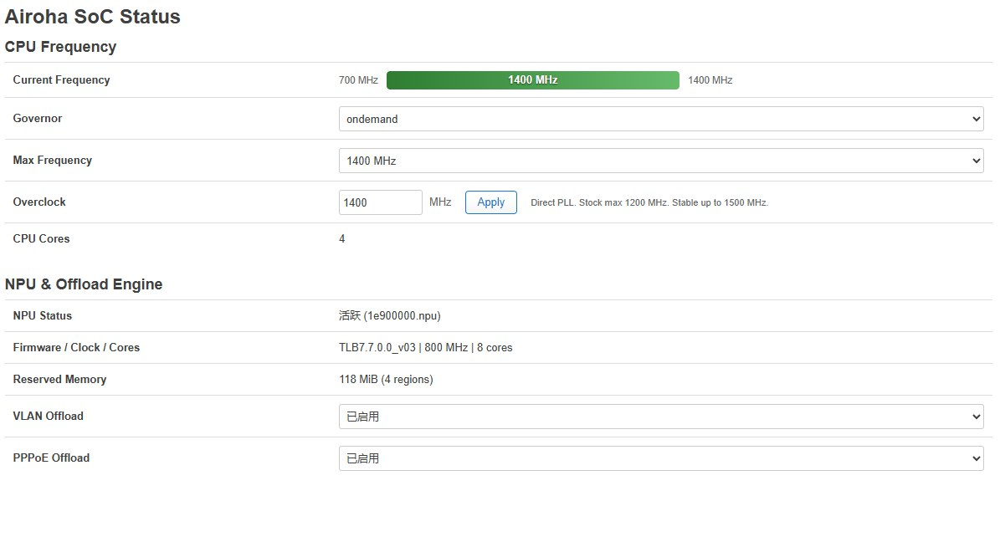

# ImmortalWrt for XG-040G-MD

ImmortalWrt firmware for NOKIA BELL XG-040G-MD

编译脚本基于 [dalutou/OpenWrt-for-XG-040G-MD](https://github.com/dalutou/OpenWrt-for-XG-040G-MD) 修改。

> **⚠️ 请准备好 USB-TTL，做好随时救砖的准备。**

## 文档

| 文档 | 内容 |
| --- | --- |
| [源码分支与跟进上游](docs/branches.md) | 两条编译线的差异、25.12 为什么固定在快照、rebase 流程 |
| [设备变体](docs/variants.md) | 三种分区布局、`tcboot.bin` 引导程序分析、能否互相升级 |
| [自定义软件包](docs/packages.md) | 内置了哪些包、选包页怎么用、刷完机还能不能补装 |
| [LED 行为](docs/leds.md) | 面板灯与网口灯的语义、怎么改成自己想要的 |

## 编译

> ### 📦 选包页
>
> **<https://loong1996.github.io/ImmortalWrt-XG-040G-MD/>**
>
> 在线勾选这次编译要带的软件包，**不用改配置文件**。页面只列出该分支真正编得出来的包，还会标出每个包刷完机能不能再 `apk add` 补装。勾完把底部生成的包名串粘进 `Run workflow` 的「附加软件包」栏即可。
>
> 详细用法见[自定义软件包 → 临时加装软件包](docs/packages.md#临时加装软件包选包页)。

本仓库只包含编译配置、补丁与 CI 流程，固件源码在 [Loong1996/immortalwrt](https://github.com/Loong1996/immortalwrt)，补丁已内置于源码分支，无需手动执行 `patch.sh`。

1. Fork 本仓库，在 Actions 页面启用 workflow
2. `Actions → XG-040G-MD → Run workflow`，选择编译分支与内存颗粒容量
3. 约 1~2 小时后，固件发布在本仓库的 Releases 中

**分支选择建议：`master-XG-040G-MD`（默认）**

| 分支 | 源码基线 | 内核 | 配置文件 | 状态 |
| --- | --- | --- | --- | --- |
| `master-XG-040G-MD` | immortalwrt `master`，落后 0 | 6.18 | `config/xg-040g-md-master.config` | ✅ 已实机验证 |
| `openwrt-25.12-XG-040G-MD` | fzs209 的实测快照，**不跟进上游** | 6.12 | `config/xg-040g-md.config` | ✅ 实测可用 |

两条线的取舍、25.12 为什么刻意停在快照上，见[源码分支与跟进上游](docs/branches.md)。

## 设备变体

实质是**三种分区布局**。25.12 线固定一种；master 线在 `Run workflow` 时用 **device_variant** 输入三选一，默认 `tcboot`。

| 变体 | 分支 | 引导程序 | rootfs 空间 | MAC 来源 | 可回退原厂 |
| --- | --- | --- | --- | --- | --- |
| `tcboot` | master | 第三方 `tcboot.bin` | **255 MB** | ubi 的 `ri` 卷，缺失则随机 | 否 |
| `stock` | master | **原厂，不动** | 129 MB | 原厂 `ri` 分区 | **是** |
| `ubi` | master | OpenWrt U-Boot | **255.875 MB** | ubi 的 `ri` 卷，缺失则随机 | 否 |
| （`bell_xg-040g-md`） | 25.12 | 第三方 `tcboot.bin` | **255 MB** | 无，随机生成 | 否 |

Release 的标题、正文与 tag 都会标出本次用的变体，例如 `XG-040G-MD-tcboot-1G-20260826-42`；25.12 线只有一个设备，tag 不带变体段。

> ⚠️ **`tcboot` 与 `ubi` 都会覆盖原厂引导和原厂分区表。** 其中 `ri`（MAC、序列号）与 `bosa`（光模块校准）是逐机唯一的出厂数据，没有公开来源，**刷这两种之前务必做整片 flash 备份**。

分区表、刷机方式、升级矩阵见[设备变体](docs/variants.md)。

## 项目说明

* 固件源码使用 [Loong1996/immortalwrt](https://github.com/Loong1996/immortalwrt)，fork 自官方 [immortalwrt/immortalwrt](https://github.com/immortalwrt/immortalwrt)。master 线的设备支持叠在上游之上，便于持续跟进；25.12 线直接采用 [fzs209/immortalwrt](https://github.com/fzs209/immortalwrt) 的实测快照。
* 闪存适配（SkyHigh S35ML02G300 与 Fudan Micro FM25G02B）：25.12 线的 SkyHigh 支持仍由本项目自带（`backport-6.12/430`、`431`，源自 [xiangtailiang/openwrt](https://github.com/xiangtailiang/openwrt)），FM25G02B 已改由上游 `backport-6.12/436`、`437` 提供；master 线两者均由上游 6.18 承担。
* 基于 [XG-040G-MD (AN7581) NPU 固件加载报错分析与修复记录](https://github.com/xiangtailiang/OpenWrt-for-XG-040G-MD/blob/main/docs/npu-firmware-load.md) 修复内核日志报错：
    ```text
    airoha-npu 1e900000.npu: Direct firmware load for airoha/en7581_npu_rv32.bin failed with error -2
    ```
* [获取超级密码](https://www.right.com.cn/FORUM/thread-8440823-1-1.html)
* [拆机、刷机、配置、原厂分区备份 教程](https://www.right.com.cn/forum/thread-8467912-1-1.html)
* 使用 [Nwrt](https://nwrt.kuroneko.host/flashdocs/XG-040G-MD.html) 提供的 [tcboot.bin](https://pan.baidu.com/s/1UWUXmZro0XFKmP-UHnbc1A?pwd=Nwrt#list/path=%2FNwrt%E5%9B%BA%E4%BB%B6%2F%E5%85%89%E7%8C%AB%E8%B4%9D%E5%B0%94) 作为引导程序。

## OpenWrt Snapshots



---

## 鸣谢 / Credits

感谢以下仓库提供的补丁与技术支持：

* [xiangtailiang/openwrt](https://github.com/xiangtailiang/openwrt)
* [bingoguo93/immortalwrt](https://github.com/bingoguo93/immortalwrt)
* [OpenWRT-fanboy/OpenW1700k](https://github.com/OpenWRT-fanboy/OpenW1700k)
