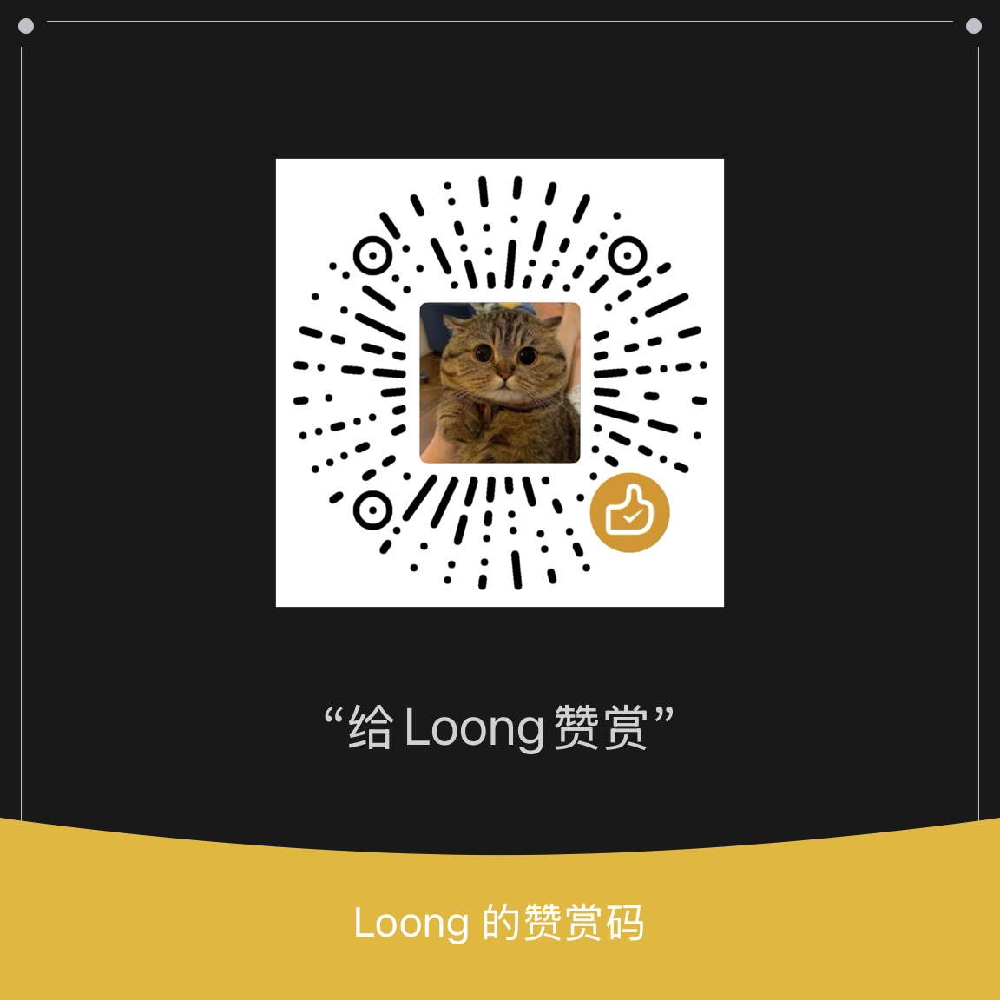

# ImmortalWrt-Airoha

ImmortalWrt firmware for Airoha-based ONTs：**Nokia XG-040G-MD**（AN7581）与 **XG-040G-MF**（AN7583）实机验证；同参考设计的 **XG-140G-MD**、**ZNXT ZN515XG-D** 实测可直接用 MD 固件。完整列表与状态见门户的[支持机型](https://loong1996.github.io/ImmortalWrt-Airoha/#models)。

🧰 [工具入口](https://loong1996.github.io/ImmortalWrt-Airoha/) · 选包 / 网页救砖教程 / 下载

两种引导：**`ubi`（推荐）**——作者魔改的 U-Boot，自带 **Airoha Web U-Boot** 网页救砖；**`stock`**——原厂引导不动，可随时刷回原厂。

> **⚠️ 请准备好 USB-TTL，做好随时救砖的准备。** 刷 `ubi` 之前务必做整片 flash 备份——`ri`（MAC、序列号）与 `bosa`（光模块校准）是逐机唯一的出厂数据，没有公开来源。

☕ 觉得有用，请作者喝杯咖啡：



## 文档

| 文档 | 内容 |
| --- | --- |
| [U-Boot 网页救砖](docs/uboot-http-recovery.md) | `ubi` 变体刷坏了，插网线用浏览器救回来：页面结构、首次迁移、面板灯语义、补丁清单 |
| [设备变体](docs/variants.md) | `ubi` 与 `stock` 两种分区布局、引导差异、内存容量自适应 |
| [本地编译](docs/local-build.md) | 不走 Actions，在自己的机器上编：机器要求、完整步骤、增量重编、从编译机拉回产物 |
| [源码分支与跟进上游](docs/branches.md) | 只维护一条线；rebase 流程与漂移检查 |
| [跟进上游：漂移检查](docs/upstream-drift.md) | rebase 看不见的那部分上游变动怎么抓 |
| [自定义软件包](docs/packages.md) | 内置了哪些包、选包页怎么用、刷完机还能不能补装 |
| [LED 行为](docs/leds.md) | 面板灯与网口灯的语义、怎么改成自己想要的 |
| [原厂备份与刷回原厂](docs/backup-and-restore.md) | 原厂分区表、整片备份步骤、回刷原厂的几条路 |
| [⚠️ 待解决：USB2 口带不动 USB3 U 盘](docs/usb2-port-issue.md) | 已排除的假设与依据、寄存器原始数据、下次从哪接手 |
| [master-airoha 迁移说明](docs/master-airoha-migration.md) | 这条线是怎么从零散提交整理出来的，历史参考 |

## 编译

本仓库只包含编译配置、自带软件包、网页与 CI 流程；固件源码在 [Loong1996/immortalwrt](https://github.com/Loong1996/immortalwrt) 的 `master-airoha` 分支，机型支持与 U-Boot 补丁都在源码树里，不需要手动打补丁。`packages/` 下的包由 `src-link` 挂成 feed。

1. Fork 本仓库，在 Actions 页面启用 workflow
2. `Actions → ImmortalWrt-Airoha → Run workflow`，选机型（`xg-040g-md` / `xg-040g-mf`）与设备变体即可——内存容量默认[自适应](docs/variants.md#内存容量)，换过颗粒也不用管
3. 约 1~2 小时后，固件发布在本仓库的 Releases 中，标题形如 `XG-040G-MD-ubi-auto-20260906-58`

手头有闲置的 Linux 机器，想反复改内核补丁或抓完整编译日志，可以不走 Actions：装好依赖后 `./build.sh` 一条命令即可，参数与 `Run workflow` 的输入一一对应——见[本地编译](docs/local-build.md)。

| 源码分支 | 基线 | 内核 | 配置文件 |
| --- | --- | --- | --- |
| `master-airoha` | immortalwrt `master`，跟进上游 | 6.18 | `config/xg-040g-md-master.config` / `config/xg-040g-mf-master.config` |

## 设备变体

实质是**两种分区布局**，`Run workflow` 时用 **device_variant** 二选一，默认 **`ubi`（推荐）**。

| 变体 | 引导程序 | rootfs 空间 | MAC 来源 | 可回退原厂 |
| --- | --- | --- | --- | --- |
| **`ubi`（推荐）** | 作者魔改 OpenWrt U-Boot，带网页救砖 | **255.875 MB** | ubi 的 `ri` 卷，缺失则随机 | 有整片备份时可经网页整片写回 |
| `stock` | **原厂，不动** | 129 MB | 原厂 `ri` 分区 | **是** |

分区表、刷机方式、升级矩阵见[设备变体](docs/variants.md)。

## 项目说明

* 编译脚本最初基于 [dalutou/OpenWrt-for-XG-040G-MD](https://github.com/dalutou/OpenWrt-for-XG-040G-MD) 修改，25.12 线来自 [fzs209](https://github.com/fzs209) 的实测快照，经过持续改写，与两者的偏差已经非常大。前身是 [ImmortalWrt-XG-040G-MD](https://github.com/Loong1996/ImmortalWrt-XG-040G-MD)，完整的提交历史、25.12 线与 tcboot 变体都保留在那边，不再更新；本仓库从一个提交起步，许可证仍是 MIT，保留原作者的版权声明。
* 固件源码使用 [Loong1996/immortalwrt](https://github.com/Loong1996/immortalwrt)，fork 自官方 [immortalwrt/immortalwrt](https://github.com/immortalwrt/immortalwrt)。机型支持叠在上游 master 之上，便于持续跟进。
* 闪存适配：内核由上游 6.18 承担（SkyHigh S35ML02G300 与 Fudan Micro FM25G01B/FM25G02B）；官方 UBI U-Boot（2026.07）只自带 SkyHigh，复旦颗粒的 `120`、`121` 两个补丁在源码树里。
* 基于 [XG-040G-MD (AN7581) NPU 固件加载报错分析与修复记录](https://github.com/xiangtailiang/OpenWrt-for-XG-040G-MD/blob/main/docs/npu-firmware-load.md) 修复内核日志报错：
    ```text
    airoha-npu 1e900000.npu: Direct firmware load for airoha/en7581_npu_rv32.bin failed with error -2
    ```
* [获取超级密码](https://www.right.com.cn/FORUM/thread-8440823-1-1.html)
* [拆机、刷机、配置、原厂分区备份 教程](https://www.right.com.cn/forum/thread-8467912-1-1.html)


